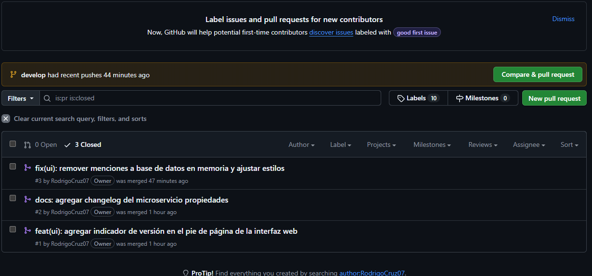

# Propiedades — Microservicio de riesgo propiedades

Microservicio correspondiente al **caso caso11 — InmoNube** (Plataforma inmobiliaria) de la Evaluación Parcial N°1.

| | |
|---|---|
| Asignatura | JVY0101 — Java: Diseño y Construcción de Soluciones Nativas en Nube |
| Stack | Spring Boot 3.3 · Java 21 · Maven · Spring Data JPA · H2 · springdoc-openapi |
| Calidad | JaCoCo cobertura LINE 100% · Cucumber (BDD) alineado a endpoints REST |
| Entrega | Docker / Docker Compose |

## Responsabilidad (SRP)

administra los datos y la lógica del dominio de Propiedades del caso caso11 (InmoNube). Su base de datos es una **H2 en memoria** (un solo microservicio por base), cumpliendo aislamiento de datos por dominio.

## Página de presentación

Al ejecutar el servicio, `http://localhost:8080/` muestra la página de presentación del microservicio con documentación y enlaces a:

- **Swagger UI**: `/swagger-ui/index.html`
- **OpenAPI (yaml)**: `/v3/api-docs.yaml`
- **ReDoc**: `/redoc.html`
- **H2 Console**: `/h2-console`

## Endpoints

| Método | Ruta | Descripción |
|--------|------|-------------|
| GET | `/api/propiedads` | Lista todos los recursos |
| GET | `/api/propiedads/{id}` | Obtiene un recurso por id |
| POST | `/api/propiedads` | Crea un recurso |
| PUT | `/api/propiedads/{id}` | Actualiza un recurso |
| DELETE | `/api/propiedads/{id}` | Elimina un recurso |

## Documentación del proyecto

La documentación completa está en la carpeta [`docs/`](docs/):

- [`docs/00_Resumen.md`](docs/00_Resumen.md) — propósito, responsabilidad y tecnologías
- [`docs/01_Arquitectura.md`](docs/01_Arquitectura.md) — componentes, arquitectura y patrones
- [`docs/02_API.md`](docs/02_API.md) — contrato REST y ejemplos curl
- [`docs/03_Pruebas.md`](docs/03_Pruebas.md) — tests unitarios, cobertura y Cucumber
- [`docs/04_Despliegue.md`](docs/04_Despliegue.md)
- [`docs/05_Justificacion.md`](docs/05_Justificacion.md) — justificación del servicio: RF/RNF/seguridad cubiertos, stack y por qué cada tecnología AWS
- [`docs/diagramas/`](docs/diagramas/) — C4 (contexto, contenedores, componentes), secuencia e infraestructura AWS — Docker, Docker Compose e integración

## Cómo ejecutar locmente

```bash
mvn spring-boot:run
```

## Cómo ejecutar con Docker

```bash
docker compose up --build
# http://localhost:8080
```

## Cómo ejecutar las pruebas

```bash
mvn test      # unit tests + Cucumber
mvn verify    # + verificación de cobertura JaCoCo (100% LINE, falla si baja)
```
# Ramificación

Elegimos GitFlow porque el curso abarca todo el semestre y cada entrega (EP01, EP02, EP03) representa un hito estable que requiere un control riguroso de versiones. Este flujo nos permite usar la rama develop para integrar continuamente las funcionalidades de ambos integrantes sin comprometer la estabilidad de main, al tiempo que nos da la flexibilidad de resolver errores críticos en producción mediante ramas hotfix/ sin interrumpir el avance del resto del equipo. De este modo, la separación clara entre el código de integración y las versiones definitivas asegura un historial limpio, ordenado y con la trazabilidad necesaria para cumplir con cada una de las rúbricas de evaluación del proyecto.


## Convención de commits
| Tipo | Para qué | Ejemplo |
| :--- | :--- | :--- |
| `feat` | Nueva funcionalidad | `feat(ui): agregar pie de pagina` |
| `fix` | Corrección de bug | `fix(home): corregir titulo` |
| `docs` | Documentación | `docs: agregar changelog` |
| `chore` | Tareas / CI | `chore(ci): agregar workflow hola mundo` |

Formato: 
Aqui son algunos commits que se hizo en el trabajo con su tipo: y su respectiva descripcion del cambio que se hizo    

fix(ui): remover menciones a base de datos en memoria y ajustar estilos     
docs: agregar changelog del microservicio pagos     
feat(ui): agregar indicador de versión en el pie de página de la interfaz web

## Naming de ramas
Aqui se veran el naming de las ramas que se ocupo para el trabajo y estas cumplen con una funcion que primero va su tipo ya sea feature o hotfix y despues va el cambio que se va a hacer y en que parte.

feature/changelog   
feature/pagina-presentacion         
hotfix/subtitulo-pagina

## Flujo de merge
Features y hotfix siempre entran por pull request, nunca push directo a main o develop.

Podemos ver en la imagen los Pull Request y los Merge que se hicieron respectivamente a cada rama y que como bien se dijo anteriormente hay una rama llamada develop en la que se hicieron los PR y que si surge un imprevisto se hace de la misma manera de un PR y se revisa y se hace Merge a la rama main
## Estrategia de revisión
La estrategia de revision de nuestro repositorio fue de que uno se encargaba de hacer un feature o hotfix o lo que corresponda y le hacia PR a la rama Develop pero este no pasaba altiro a merge sino que se mantenia en espera para ser revisado y poder hacer los test correspondientes de que estaba en funcionamiento y si no habia ningun error se le hacia el merge correspondiente 